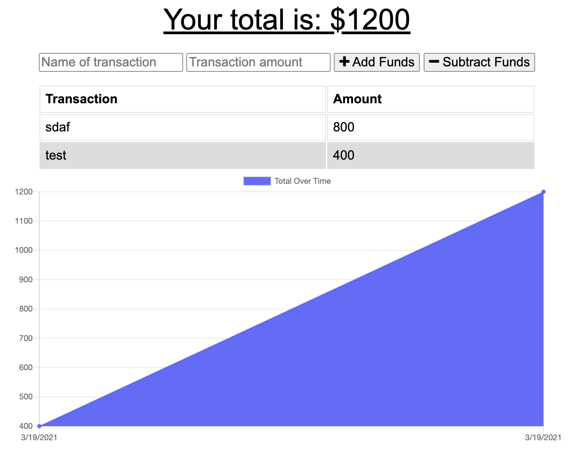

## Description

This is a progressive web app that allows for users to store and visualize their budgets and save them offline. If you save the app to your homescreen, it can be accessed without an internet connection. This app was created using Node, express, and webpack

# Screenshot

# Table of Contents 

1. [Description](#Description)
 2. [Questions](#Questions?) 

 3. [Installation](#Installation) 

 4. [Usage](#Usage) 

 5. [Contributing](#Contributing) 

6. [License](#License) 

 7. [Tests](#Tests)

## Installation
npm install

npm start

## Usage

## Contributing

## Questions?

Contact me here:

[GitHub Profile](https://www.github.com/mokulling)

[Email](mailto:mokulling@gmail.com)

 Reach out to me at either of the links above if you have any questions regarding the project or if you want to become a collaborator.

## License
CC

## Tests